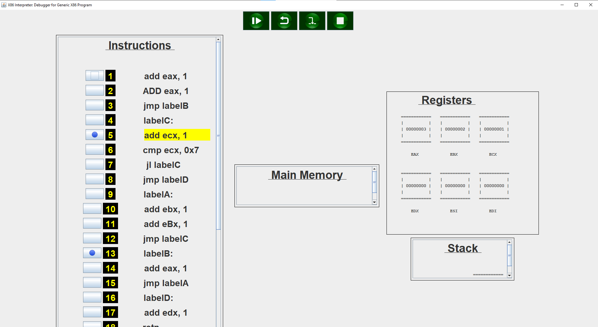

# X86-Interpreter
This is a program to debug x86 assembly/ASM code. It supports debugging multiple X86 "programs" at the same time ("Programs" being lines of X86 instructions, in this case), as well as updating the lines of code of the most recently added "program". For example, if you are testing something in assembly, and want to see how it behaves differently if you insert another line of assembly code, or if you want to change different initial input to different values, you can! It also runs the entire program before displaying the GUI, so it supports backstepping, as well as stepping into! Also included are breakpoints, and a Run/Continue button for running until hitting the breakpoints, as well as a stop button to exit the currently loaded "program".


# Example
Here is an example of what the program looks like when running it:


This is an example instructions format that's accepted for the program, and is the same example that was used in the above image:
```
add eax, 1
ADD eax, 1
jmp labelB
labelC:
add ecx, 1
cmp ecx, 0x7
jl labelC
jmp labelD
labelA:
add ebx, 1
add eBx, 1
jmp labelC
labelB:
add eax, 1
jmp labelA
labelD:
add edx, 1
retn
```


# How to Install All Dragon Games Programs
- (0) ~~(Not Required for This Particular Program)~~
- (1) Go to C:/Users/Public
- (2) Create a File "Windhunter's Programs - Main Folder Location.txt"
- (3) In This .txt File, Put the Location of Your Installation Directory (e.g. "C:/Windhunter's Programs/")
- (4) Put the "X86-Interpreter" Folder (With Its Name As-Is) in This "Installation" Directory
- (5) Install Java (SE 9 Or Higher Might Work; SE 13 and Higher Have Been Tested to Work)

# Changelog
- Version 1.0 -> Initial Program

# Notes
- Currently Does Not Support the "Call" Opcode

# Authors (So Far)
- Evan Baker

